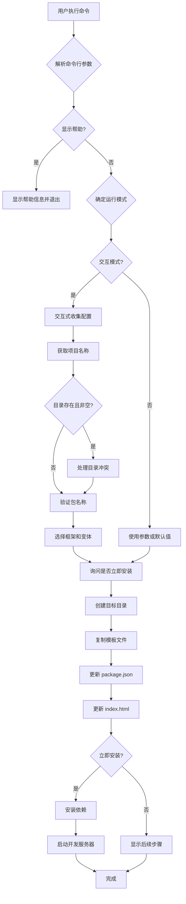

# Design Document: create-rolldown

## Overview

create-rolldown 是一个命令行脚手架工具，用于快速创建基于 Rolldown 打包工具的前端项目。该工具采用与 create-vite 相似的架构设计，提供交互式和非交互式两种使用模式，支持多种前端框架模板。

核心设计理念：

- **简单易用**：提供友好的交互式界面和清晰的命令行参数
- **灵活可扩展**：模板系统易于扩展，支持添加新框架
- **智能检测**：自动检测包管理器和运行环境
- **开发体验优先**：支持一键安装依赖并启动开发服务器

## Architecture

### 整体架构

```
create-rolldown/
├── index.js                 # CLI 入口文件（指向编译后的代码）
├── src/
│   └── index.ts            # 核心逻辑实现
├── template-vanilla/        # Vanilla JS 模板
├── template-vanilla-ts/     # Vanilla TS 模板
├── template-vue/           # Vue JS 模板
├── template-vue-ts/        # Vue TS 模板
├── template-react/         # React JS 模板
├── template-react-ts/      # React TS 模板
├── template-svelte/        # Svelte JS 模板
├── template-svelte-ts/     # Svelte TS 模板
├── template-solid/         # Solid JS 模板
├── template-solid-ts/      # Solid TS 模板
├── template-qwik/          # Qwik JS 模板
└── template-qwik-ts/       # Qwik TS 模板
```

### 执行流程



## Components and Interfaces

### 1. CLI 入口模块 (index.ts)

主入口文件，负责初始化和错误处理。

```typescript
async function init(): Promise<void>;
```

### 2. 参数解析模块

使用 `mri` 库解析命令行参数。

```typescript
interface CLIArguments {
  _: string[]; // 位置参数
  template?: string; // 模板名称
  help?: boolean; // 显示帮助
  overwrite?: boolean; // 覆盖现有文件
  immediate?: boolean; // 立即安装并启动
  interactive?: boolean; // 强制交互/非交互模式
}
```

### 3. 交互式提示模块

使用 `@clack/prompts` 库提供交互式界面。

```typescript
// 项目名称输入
async function promptProjectName(defaultValue: string): Promise<string>;

// 目录冲突处理
async function promptOverwrite(targetDir: string): Promise<'yes' | 'no' | 'ignore'>;

// 包名称输入
async function promptPackageName(defaultValue: string): Promise<string>;

// 框架选择
async function promptFramework(frameworks: Framework[]): Promise<Framework>;

// 变体选择
async function promptVariant(variants: FrameworkVariant[]): Promise<string>;

// 立即安装确认
async function promptImmediate(pkgManager: string): Promise<boolean>;
```

### 4. 框架和模板管理模块

```typescript
interface Framework {
  name: string; // 框架标识符
  display: string; // 显示名称
  color: ColorFunc; // 颜色函数
  variants: FrameworkVariant[]; // 变体列表
}

interface FrameworkVariant {
  name: string; // 变体标识符（模板名称）
  display: string; // 显示名称
  color: ColorFunc; // 颜色函数
  customCommand?: string; // 自定义创建命令（可选）
}

const FRAMEWORKS: Framework[] = [
  // 框架定义列表
];

const TEMPLATES: string[] = [
  // 所有可用模板名称的扁平列表
];
```

### 5. 文件系统操作模块

```typescript
// 复制文件或目录
function copy(src: string, dest: string): void;

// 递归复制目录
function copyDir(srcDir: string, destDir: string): void;

// 清空目录（保留 .git）
function emptyDir(dir: string): void;

// 检查目录是否为空
function isEmpty(path: string): boolean;

// 写入文件（支持内容转换）
function write(file: string, content?: string): void;

// 编辑文件内容
function editFile(file: string, callback: (content: string) => string): void;
```

### 6. 包管理器检测模块

使用 `@vercel/detect-agent` 库检测包管理器。

```typescript
interface PkgInfo {
  name: string; // 包管理器名称
  version: string; // 版本号
}

// 从 user agent 解析包管理器信息
function pkgFromUserAgent(userAgent: string | undefined): PkgInfo | undefined;

// 获取安装命令
function getInstallCommand(agent: string): string[];

// 获取运行脚本命令
function getRunCommand(agent: string, script: string): string[];
```

### 7. 命令执行模块

使用 `cross-spawn` 库执行外部命令。

```typescript
// 执行命令
function run(command: string[], options?: SpawnOptions): void;

// 安装依赖
function install(root: string, agent: string): void;

// 启动开发服务器
function start(root: string, agent: string): void;
```

### 8. 验证和格式化模块

```typescript
// 格式化目标目录路径
function formatTargetDir(targetDir: string): string;

// 验证包名称是否合法
function isValidPackageName(projectName: string): boolean;

// 转换为合法的包名称
function toValidPackageName(projectName: string): string;
```

## Data Models

### 模板目录结构

每个模板目录包含完整的项目结构：

```
template-{name}/
├── _gitignore              # .gitignore 文件（使用 _ 前缀避免 npm 发布时被忽略）
├── index.html              # HTML 入口文件
├── package.json            # 依赖声明
├── rolldown.config.{js|ts} # Rolldown 配置
├── tsconfig.json           # TypeScript 配置（仅 TS 变体）
├── README.md               # 项目说明
├── public/                 # 静态资源目录
│   └── ...
└── src/                    # 源代码目录
    └── ...
```

### 文件重命名映射

```typescript
const renameFiles: Record<string, string | undefined> = {
  _gitignore: '.gitignore',
};
```

### 默认配置

```typescript
const defaultTargetDir = 'rolldown-project';
const defaultTemplate = 'vanilla-ts';
```

## Correctness Properties

_属性（Property）是关于系统行为的形式化陈述，应该在所有有效执行中保持为真。属性是人类可读规范和机器可验证正确性保证之间的桥梁。_

### Property 1: CLI 模式检测正确性

_对于任何_ 运行环境（TTY/非TTY）和命令行参数组合，CLI 应该根据环境和参数正确选择交互模式或非交互模式。
**Validates: Requirements 1.1, 1.7, 2.1, 10.1**

### Property 2: 命令行参数应用正确性

_对于任何_ 有效的命令行参数组合（目标目录、模板、覆盖标志、立即安装标志），CLI 应该正确应用所有参数到项目创建过程中。
**Validates: Requirements 1.3, 1.4, 1.5, 1.6**

### Property 3: 目录名称格式化幂等性

_对于任何_ 目录路径字符串，多次应用 formatTargetDir 函数应该产生相同的结果（幂等性）。
**Validates: Requirements 1.3**

### Property 4: 包名称验证和转换正确性

_对于任何_ 字符串，如果它不是有效的 npm 包名称，toValidPackageName 函数应该将其转换为有效的包名称，且转换后的名称应该通过 isValidPackageName 验证。
**Validates: Requirements 2.5, 10.5**

### Property 5: 模板完整性

_对于任何_ 模板目录，它应该包含所有必需的文件：package.json、README.md、\_gitignore（或 .gitignore）、rolldown 配置文件，以及如果是 TypeScript 变体则包含 tsconfig.json。
**Validates: Requirements 3.4, 9.1, 9.2, 9.3, 9.4, 9.5**

### Property 6: 框架变体对称性

_对于任何_ 支持 TypeScript 的框架，如果存在 TypeScript 变体，则必须存在对应的 JavaScript 变体。
**Validates: Requirements 3.2**

### Property 7: 文件重命名一致性

_对于任何_ 需要重命名的文件（如 \_gitignore），在复制到目标目录后，文件名应该根据 renameFiles 映射正确转换。
**Validates: Requirements 3.6**

### Property 8: 目录结构保持性

_对于任何_ 模板目录，复制后的目标目录应该保持与模板相同的目录结构（文件和子目录的相对路径关系）。
**Validates: Requirements 4.1, 4.2**

### Property 9: package.json 名称替换正确性

_对于任何_ 有效的包名称和模板，生成的 package.json 文件中的 name 字段应该等于用户指定的包名称。
**Validates: Requirements 4.3**

### Property 10: index.html 标题更新正确性

_对于任何_ 项目名称和模板，生成的 index.html 文件中的 title 标签内容应该等于用户指定的项目名称。
**Validates: Requirements 4.4**

### Property 11: 目录清空保留 .git

_对于任何_ 包含 .git 目录的非空目录，调用 emptyDir 后，.git 目录应该保留，其他文件和目录应该被删除。
**Validates: Requirements 4.6**

### Property 12: 包管理器命令格式正确性

_对于任何_ 支持的包管理器（npm、pnpm、yarn、bun、deno），getInstallCommand 和 getRunCommand 应该返回该包管理器的正确命令格式。
**Validates: Requirements 5.3, 6.2**

### Property 13: 错误处理一致性

_对于任何_ 导致错误的操作（命令执行失败、文件系统错误、用户取消），CLI 应该显示有意义的错误消息并以非零状态码退出（或在取消时优雅退出）。
**Validates: Requirements 8.1, 8.2, 8.3, 8.4**

### Property 14: 非交互模式默认值正确性

_对于任何_ 在非交互模式下未提供的必需参数，CLI 应该使用正确的默认值（项目名称为 "rolldown-project"，模板为 "vanilla-ts"）。
**Validates: Requirements 10.2, 10.3**

### Property 15: 包名称转换往返一致性

_对于任何_ 已经是有效包名称的字符串，应用 toValidPackageName 后应该保持不变或产生等价的有效名称。
**Validates: Requirements 2.5, 10.5**

## Error Handling

### 错误类型和处理策略

1. **命令行参数错误**
   - 无效的模板名称：在交互模式下显示可用模板列表，在非交互模式下使用默认模板
   - 无效的项目名称：提示用户输入有效名称或自动转换

2. **文件系统错误**
   - 目标目录不可写：显示权限错误并退出
   - 磁盘空间不足：显示错误信息并退出
   - 模板目录不存在：显示错误信息并退出

3. **命令执行错误**
   - 依赖安装失败：显示错误信息和退出状态码
   - 开发服务器启动失败：显示错误信息和退出状态码

4. **用户取消操作**
   - 在任何交互提示中取消：显示 "Operation cancelled" 并优雅退出
   - 不创建任何文件或修改任何现有文件

5. **目录冲突**
   - 目标目录非空：在交互模式下提供选项（取消、覆盖、忽略），在非交互模式下需要 --overwrite 标志

### 错误消息格式

所有错误消息应该：

- 清晰描述问题
- 提供可能的解决方案（如果适用）
- 使用适当的颜色编码（红色表示错误）

## Testing Strategy

### 测试方法

本项目采用**双重测试策略**，结合单元测试和基于属性的测试（Property-Based Testing, PBT）：

- **单元测试**：验证特定示例、边缘情况和错误条件
- **属性测试**：验证跨所有输入的通用属性

两种测试方法是互补的，共同提供全面的测试覆盖。

### 单元测试

单元测试应该专注于：

- **特定示例**：验证核心功能的具体用例
- **边缘情况**：空字符串、特殊字符、极长路径等
- **错误条件**：无效输入、文件系统错误、命令执行失败
- **集成点**：组件之间的交互

**测试框架**：Vitest

**测试文件组织**：

```
src/
├── index.ts
└── index.test.ts
```

### 基于属性的测试

属性测试应该专注于：

- **通用属性**：应该对所有输入保持为真的规则
- **不变量**：操作前后保持不变的属性
- **往返属性**：序列化/反序列化、格式化/解析等
- **幂等性**：重复操作产生相同结果

**测试框架**：fast-check（JavaScript/TypeScript 的属性测试库）

**配置要求**：

- 每个属性测试至少运行 100 次迭代
- 每个测试必须引用设计文档中的属性
- 标签格式：`// Feature: create-rolldown, Property {number}: {property_text}`

**示例属性测试**：

```typescript
import fc from 'fast-check';
import { describe, it, expect } from 'vitest';
import { formatTargetDir } from './index';

describe('Property Tests', () => {
  it('Property 3: Directory name formatting idempotence', () => {
    // Feature: create-rolldown, Property 3: 目录名称格式化幂等性
    fc.assert(
      fc.property(fc.string(), (dirName) => {
        const formatted1 = formatTargetDir(dirName);
        const formatted2 = formatTargetDir(formatted1);
        expect(formatted1).toBe(formatted2);
      }),
      { numRuns: 100 }
    );
  });

  it('Property 4: Package name validation and conversion', () => {
    // Feature: create-rolldown, Property 4: 包名称验证和转换正确性
    fc.assert(
      fc.property(fc.string(), (name) => {
        const validName = toValidPackageName(name);
        expect(isValidPackageName(validName)).toBe(true);
      }),
      { numRuns: 100 }
    );
  });
});
```

### 测试覆盖目标

- 代码覆盖率：>80%
- 所有核心函数都有单元测试
- 所有设计文档中的属性都有对应的属性测试
- 所有错误处理路径都有测试

### 测试环境

- 使用 `_ROLLDOWN_TEST_CLI` 环境变量跳过实际的命令执行
- 使用临时目录进行文件系统操作测试
- 模拟不同的包管理器环境

### 集成测试

除了单元测试和属性测试，还应该包括端到端的集成测试：

- 完整的项目创建流程
- 不同模板的生成
- 不同包管理器的使用
- 交互模式和非交互模式的切换

## Implementation Notes

### 技术栈

- **语言**：TypeScript
- **构建工具**：tsdown（与 create-vite 保持一致）
- **CLI 交互**：@clack/prompts
- **参数解析**：mri
- **进程执行**：cross-spawn
- **颜色输出**：picocolors
- **包管理器检测**：@vercel/detect-agent

### 开发工作流

1. **开发模式**：`npm run dev` - 监听文件变化并自动编译
2. **构建**：`npm run build` - 编译 TypeScript 到 dist 目录
3. **类型检查**：`npm run typecheck` - 运行 TypeScript 类型检查
4. **测试**：`npm test` - 运行所有测试

### 发布配置

package.json 配置：

```json
{
  "name": "create-rolldown",
  "version": "0.1.0",
  "type": "module",
  "license": "MIT",
  "bin": {
    "create-rolldown": "index.js"
  },
  "files": ["index.js", "template-*", "dist"],
  "engines": {
    "node": "^20.19.0 || >=22.12.0"
  }
}
```

### 模板开发指南

创建新模板时：

1. 创建 `template-{name}` 目录
2. 添加完整的项目结构
3. 使用 `_gitignore` 而不是 `.gitignore`
4. 在 package.json 中使用占位符名称
5. 在 FRAMEWORKS 数组中注册新模板
6. 确保包含所有必需的配置文件

### 性能考虑

- 文件复制使用流式操作以支持大文件
- 避免不必要的文件读取
- 使用异步操作避免阻塞

### 安全考虑

- 验证所有用户输入
- 使用 path.resolve 和 path.join 避免路径遍历攻击
- 不执行用户提供的任意代码
- 清理目录时保留 .git 以避免意外删除版本控制历史

## Future Enhancements

1. **自定义模板支持**：允许用户从 Git 仓库或本地路径使用自定义模板
2. **模板预览**：在选择模板前显示模板的预览信息
3. **配置文件**：支持 .create-rolldownrc 配置文件保存用户偏好
4. **插件系统**：允许扩展 CLI 功能
5. **更多框架支持**：添加 Angular、Ember 等框架的模板
6. **交互式配置**：在创建项目后提供交互式配置向导
7. **依赖更新检查**：检查模板依赖是否有更新版本
